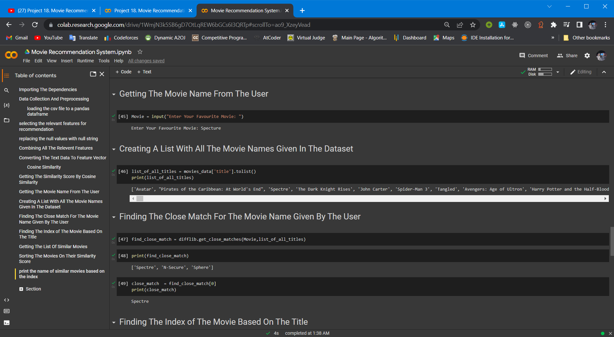
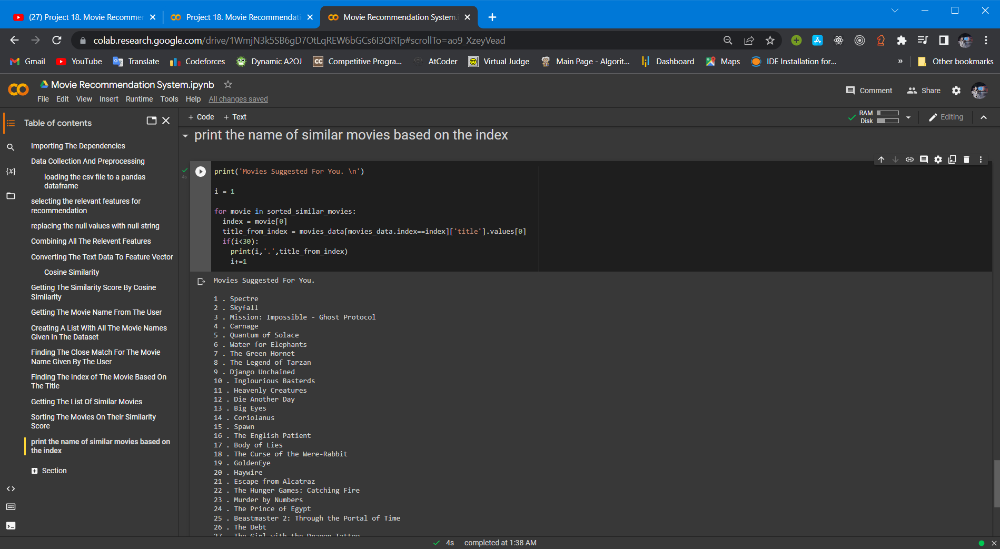

<html>

<body>
<h1>Movie Recommendation System</h1>
<h1>Libraries Used: </h1>
<ul>
<li>Numpy</li>
<li>Pandas</li>
<li>Matplotlib</li>
<li>difflib</li>
<li>Sklearn</li>
<li>TFVectorizer</li>
<li>Cosine Similarity</li>
</ul>
<h1>Movie Recommendation System </h1>
<ul><li>Content Based</li><li>Popularity Based</li><li>Collaborative Based</li></ul>
<h1><b>WorkFlow</b></h1>

<ol>
<li>Movies Data</li>
<li>Data Preprocessing</li>
<li>Feature Extraction</li>
<li>User Input</li>
<li>Cosine Similarity Algorithm</li>
<li>List of Movies</li>
</ol>
<h1>Giving Movie Name </h1>

<h1>Getting Recomendations</h1>

<video width="320" height="240" controls>
  <source src="./files/movie_recomender.mp4" type="video/mp4">
Video: 
</video>

<a href="">Dataset</a>
</body>

</html>
